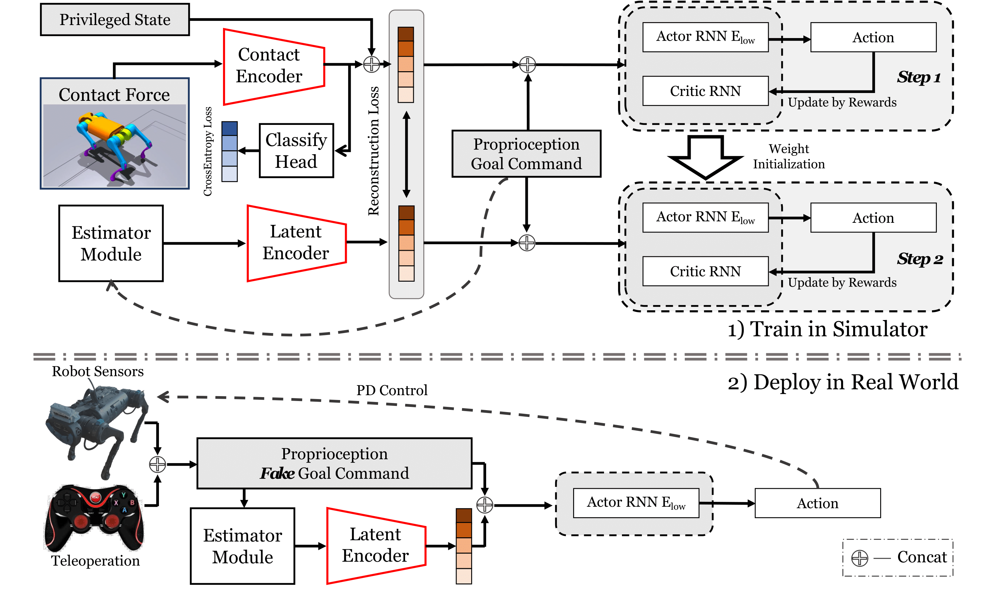

<!-- <a href=https://arxiv.org/abs/2406.09402></a> <a href='https://immortalco.github.io/Instruct-4D-to-4D/'></a>  -->

<div align="center">

# Robust Robot Walker: Learning Agile Locomotion over Challenge Terrains

[](https://arxiv.org/abs/2409.07409) [](https://2025.ieee-icra.org/) [](https://robust-robot-walker.github.io/) [](https://opensource.org/licenses/MIT)

</div>


> [Robust Robot Walker: Learning Agile Locomotion over Challenge Terrains](https://arxiv.org/abs/2409.07409) \
> Shaoting Zhu, Runhan Huang, Linzhan Mou, Hang Zhao \
> ICRA 2025

## Installation

### 1. Create a Python Virtual Environment
- Create a new Python virtual environment with Python 3.6, 3.7, or 3.8 (Python 3.8 is recommended).

### 2. Install PyTorch 1.10 with CUDA 11.3
Run the following command to install PyTorch:

```bash
pip3 install torch==1.10.0+cu113 torchvision==0.11.1+cu113 torchaudio==0.10.0+cu113 -f https://download.pytorch.org/whl/cu113/torch_stable.html
```

### 3. Install Isaac Gym
- Download and install **Isaac Gym Preview 4** from [NVIDIA Isaac Gym](https://developer.nvidia.com/isaac-gym).
- Install the required Python bindings:

```bash
cd isaacgym/python && pip install -e .
```

- Test the installation by running an example:

```bash
cd examples && python 1080_balls_of_solitude.py
```

- For troubleshooting, check the Isaac Gym documentation at `isaacgym/docs/index.html`.

### 4. Clone This Repository
Clone the repository with the following command:

```bash
git clone https://github.com/zst1406217/robust_robot_walker.git
cd robust_robot_walker
```

### 5. Install `rsl_rl` (PPO Implementation)
```bash
cd rsl_rl && pip install -e .
```

### 6. Install `legged_gym`
```bash
cd legged_gym && pip install -e .
```

### 7. Install Additional Dependencies
Install the necessary dependencies:

```bash
pip install debugpy tqdm numpy==1.19.5 tensorboard==2.0.0 setuptools==58.5.0 protobuf==3.20.0 matplotlib==3.4.0
```

### 8. Download the AMP dataset
Download and put the [mpc_data_no_command.npy](https://drive.google.com/file/d/1zWMzw6EK7PKM8V5u1HQ4SrbvkIZ-veHG/view?usp=sharing) in `./legged_gym`.

## Run Tiny-Trap Benchmark
1. Navigate to the `legged_gym` folder:

```bash
cd legged_gym
```

2. The trained policy is stored in `checkpoint.zip`. Unzip it and place the folder in `legged_gym/logs/rrw_a1`.

3. Make sure you're in the `robust_robot_walker/legged_gym` directory, and run the benchmark:

```bash
python legged_gym/scripts/track.py --task a1_bartrack --load_run checkpoint --headless
```

This will output the success rate, average pass time, and average travel distance of 1,000 robots. Due to the random seed and varying GPU devices, results may slightly differ from the paper.

## Policy Training


### 1. Train Walking Policy on Plane
To train the walking policy on a flat plane:

```bash
cd legged_gym
```

Ensure you are in the `robust_robot_walker/legged_gym` directory, and then run:

```bash
python legged_gym/scripts/train.py --task a1_remotegoal --headless
```

### 2. Train Robust-Robot-Walker Policy (Stage 1)
1. Update the `"load_run"` parameter in the `legged_gym/envs/a1/a1_mix_goal_stage1_config.py` file (line 182) with the log directory from Step 1 (Train walking policy on the plane).

   For example:

   ```python
   load_run = "Mar14_12-59-47_WalkByRemoteGoal_noResume"
   ```

2. Make sure you're in the `robust_robot_walker/legged_gym` folder and run:

```bash
python legged_gym/scripts/train.py --task a1_mixgoalstage1 --headless
```

### 3. Train Robust-Robot-Walker Policy (Stage 2)
1. Update the `"load_run"` parameter in the `legged_gym/envs/a1/a1_mix_goal_stage2_config.py` file (line 182) with the log directory from Step 2 (Train robust-robot-walker policy, stage 1).

2. Run the following:

```bash
python legged_gym/scripts/train.py --task a1_mixgoalstage2 --headless
```

## Test and Visualize Walking Policy on Plane
To test and visualize the walking policy:

```bash
cd legged_gym
python legged_gym/scripts/play.py --task a1_mixgoalstage2 --load_run <your_log_dir>
```

## Deployment on Real Robot
Please refer to the [Deploy.md](./Deploy.md) for instructions on deploying to a real robot.

## Acknowlegement
https://github.com/leggedrobotics/legged_gym<br>
https://github.com/ZiwenZhuang/parkour

## Citation

You can find our paper on [arXiv](https://arxiv.org/abs/2409.07409).

If you find this code or find the paper useful for your research, please consider citing:

```
@article{zhu2024robust,
  title={Robust Robot Walker: Learning Agile Locomotion over Tiny Traps},
  author={Shaoting, Zhu and Runhan, Huang and Linzhan, Mou and Hang, Zhao},
  journal={arXiv preprint arXiv:2409.07409},
  year={2024}
}
```

---
